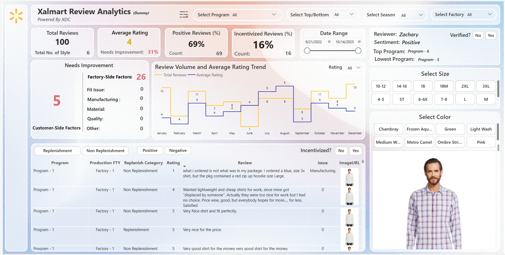

# Xalmart Review Analytics System (Dummy Data)

An automated review intelligence pipeline designed to transform raw customer feedback into actionable business insights.

This project demonstrates how review data can be collected, standardized, enriched, and analyzed through an integrated analytics system.

⚠️ All brand names, programs, factories, and datasets are anonymized for confidentiality and portfolio demonstration.

<table>
  <tr>
    <td>
      
    </td>
  </tr>
</table>

---

# Project Vision

Customer feedback contains powerful signals about product performance and operational gaps.

However, extracting insights from reviews is often manual and inefficient.

Teams typically:

- copy reviews from websites
- clean the text manually
- match product details
- combine internal operational data
- prepare data for reporting

As review volume increases, this process becomes slow and unsustainable.

This project demonstrates how automation can eliminate that friction.

---

# System Architecture

The solution follows a three-layer architecture:

### 1️⃣ Data Collection Layer

Customer reviews are collected and stored in a structured dataset.

The system prepares review attributes such as:

- rating
- review text
- program
- product attributes
- factory information
- incentivized review flag

---

### 2️⃣ Data Processing & Automation

The pipeline automatically:

- cleans review text
- standardizes rating structures
- enriches missing attributes from internal datasets
- connects website feedback with operational metadata
- prepares analysis-ready tables

This transforms unstructured feedback into structured analytics data.

---

### 3️⃣ Analytics Layer (Power BI)

Power BI then converts the processed dataset into interactive intelligence.

The dashboard enables stakeholders to analyze:

- review sentiment trends
- program-level performance
- product attribute feedback
- factory-linked quality signals
- seasonality effects on customer sentiment

---

# Key Business Questions Answered

The system helps decision-makers answer critical questions such as:

- Which programs are receiving the highest and lowest ratings?
- Are product issues driven by manufacturing or customer preferences?
- Which product attributes trigger the most complaints?
- Are incentivized reviews affecting sentiment trends?
- How does feedback change across seasons?
- Which factories are linked to quality issues?

---

# Dashboard Features

Executive-level insights include:

- Total Reviews
- Average Rating
- Positive Review Rate
- Incentivized Review Share
- Review Trend Analysis
- Issue Classification
- Product Attribute Filtering
- Review-Level Investigation

The dashboard consolidates all key feedback metrics into a single analytical interface.

---

# Business Impact

This system enables organizations to:

- detect product quality issues early
- monitor customer sentiment trends
- identify operational improvement areas
- reduce manual analysis work
- scale review intelligence across large datasets

---

# Data Disclaimer

All datasets in this project are synthetic and anonymized.

The structure reflects real-world analytics workflows but does not contain any proprietary or confidential information.

---

# Author

Didarul Islam  
Business Intelligence Developer
